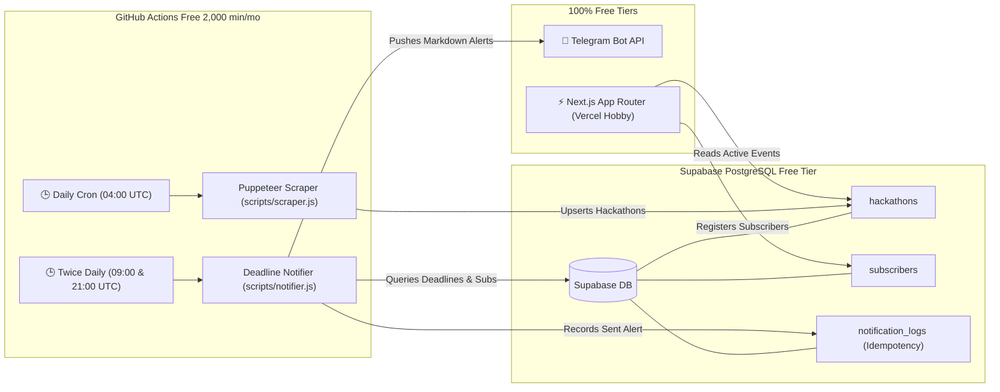

# 🚀 HackTrack — Live Student Hackathon Tracker & Free Serverless Alert Platform

> **100% Free Serverless Architecture**: Aggregates collegiate and global student hackathons from Devpost, MLH, and Unstop, stores them in Supabase PostgreSQL, runs scheduled scraper & notifier engines on GitHub Actions crons, and delivers instant, zero-cost deadline alerts directly to students via Telegram Bot API.

---

## 🏛️ System Architecture



---

## 💡 Why This Platform Costs $0.00 / Month Forever

| Component | Free Provider | Free Tier Limit | Our Utilization | Cost |
| :--- | :--- | :--- | :--- | :--- |
| **Frontend & API** | Vercel Hobby | 100 GB Bandwidth, Edge Network | Next.js 16 App Router with ISR & Serverless API | **$0/mo** |
| **Database** | Supabase | 500 MB Postgres, 50,000 MAU | Relational indexing, RLS, stores 50,000+ hackathons | **$0/mo** |
| **Cron & Compute** | GitHub Actions | 2,000 Linux Minutes / Month | Scraper (~45 min/mo) + Notifier (~20 min/mo) | **$0/mo** |
| **Notification Engine** | Telegram Bot API | Unlimited messages, no credit card needed | Direct HTTPS calls to Bot API with rich Markdown | **$0/mo** |

---

## 📂 Project Structure

```
├── .github/workflows/
│   ├── scraper.yml          # Scheduled 12-hour cron running node scripts/scrape.js
│   └── notify.yml           # Scheduled daily cron running node scripts/notify.js
├── scripts/
│   ├── scrape.js            # Puppeteer scraper engine for Devpost & Unstop + Supabase upsert
│   ├── notify.js            # node-telegram-bot-api notifier querying deadlines < 48 hours
│   └── seed.js              # Database seeder with realistic 2026 student events
├── supabase/
│   └── migrations/
│       └── 20261003000000_init_schema.sql  # Hackathons (registration_end) & Users tables + RLS
├── src/
│   ├── app/
│   │   ├── api/
│   │   │   ├── hackathons/route.ts     # GET: Search, filter by tag/location, sort
│   │   │   ├── subscribe/route.ts      # POST: Save subscriber Chat ID to Users table
│   │   │   └── telegram-test/route.ts  # POST: Live test verification ping
│   │   ├── globals.css      # Tailwind CSS v4 + modern dark mode styling
│   │   ├── layout.tsx       # Root layout with SEO and metadata
│   │   └── page.tsx         # Responsive Tailwind CSS dashboard + "Get Telegram Alerts" button
│   ├── components/
│   │   ├── Header.tsx       # Brand header with "Get Telegram Alerts" bot link
│   │   ├── HeroBanner.tsx   # Hero section with < 48h deadline highlight & Telegram CTA
│   │   ├── FilterBar.tsx    # Multi-tag chips, search input & location filters
│   │   ├── HackathonCard.tsx# Tailwind card with < 48h deadline countdown badges
│   │   ├── SubscribeModal.tsx# Walkthrough modal for Telegram Chat ID + test ping
│   │   ├── HowItWorks.tsx   # Architecture transparency section
│   │   └── StatsBar.tsx     # Metrics bar (Total prizes, active events, latency)
│   └── lib/
│       ├── mockData.ts      # Curated high-res hackathons fallback
│       ├── supabase.ts      # Supabase client with graceful mock mode
│       ├── telegram.ts      # Telegram Bot API message builder & delivery
│       └── types.ts         # TypeScript definitions
├── postcss.config.mjs       # Tailwind CSS v4 PostCSS configuration
├── .env.example             # Environment template
└── package.json
```

---

## 🚀 Quickstart Guide

### 1. Install Dependencies
```bash
pnpm install
```

### 2. Configure Environment Variables
Copy `.env.example` to `.env.local`:
```bash
cp .env.example .env.local
```
Fill in your keys:
- `NEXT_PUBLIC_SUPABASE_URL`
- `NEXT_PUBLIC_SUPABASE_ANON_KEY`
- `SUPABASE_SERVICE_ROLE_KEY`
- `TELEGRAM_BOT_TOKEN`

*(Note: The platform includes high-fidelity mock fallback data out of the box, so you can test the UI and run scripts even before setting up keys!)*

### 3. Run Development Server
```bash
pnpm dev
```
Open [http://localhost:3000](http://localhost:3000) in your browser.

---

## 🗄️ Setting up Supabase Database
 
1. Create a free project at [supabase.com](https://supabase.com).
2. Open the **SQL Editor** tab in the Supabase dashboard.
3. Apply the initial schema and the localization migration:
   - Initial schema: `supabase/migrations/20261003000000_init_schema.sql`
   - Location & Currency Localization: `supabase/migrations/20261003010000_location_and_currency_localization.sql`
     *(Adds `mode`, `country`, `state`, `city`, `prize_currency`, `prize_amount` to `hackathons`, and `preferred_country`, `preferred_city`, `preferred_mode` to `users`)*
4. Seed initial localized events (Bangalore, India INR & Global USD):
   ```bash
   node scripts/seed.js
   ```

---

## 🌍 Location and Currency Localization Features

- **Geographic Filtering**: Filter hackathons by Country (e.g., India, USA) and City (especially focusing on major Indian tech hubs like **Bangalore**, **Delhi**, **Mumbai**, **Hyderabad**, and **Pune**).
- **Format Toggle**: Toggle between **'Online'**, **'In-Person'**, or **'Both'**.
- **Dynamic Currency Formatter**: Hackathon cards dynamically format prizes:
  - **INR (₹)**: Formats using the Indian numbering system (`₹10,00,000` / `₹1,00,000`).
  - **USD ($)**: Formats using Western numbering (`$50,000` / `$10,000`).
- **Personalized Telegram Alerts**: When subscribing to Telegram alerts, users can choose their `preferred_city` (e.g. Bangalore) and `preferred_mode` (Online only, In-person only, or Both).
- **Explicit Telegram Alert Format**:
  - `📍 Mode: In-Person, Bangalore (India)` or `🌐 Mode: Online`
  - Localized prize money (e.g. `💰 Prize Pool: ₹10,00,000 INR` or `$50,000 USD`)

---

## 🤖 Creating Your Free Telegram Bot in 60 Seconds

1. Open Telegram and search for [`@BotFather`](https://t.me/BotFather).
2. Send `/newbot`.
3. Choose a name (e.g. `HackTrack Student Radar`) and a username ending in `bot` (e.g. `HackTrackRadarBot`).
4. Copy the API Token provided by BotFather and set it as `TELEGRAM_BOT_TOKEN`.
5. Open your newly created bot in Telegram and click **Start** (`/start`).

---

## ⚙️ Running Automation Scripts
 
### Scrape Hackathons (Puppeteer & Supabase Upsert)
```bash
pnpm run scrape
# or
node scripts/scrape.js
```
 
### Run Telegram Deadline Alerts (< 48 Hours, node-telegram-bot-api)
```bash
pnpm run notify
# or
node scripts/notify.js
```

---

## ☁️ GitHub Actions & Vercel Deployment

### 1. Deploy Frontend to Vercel
1. Push repository to GitHub.
2. Import project into [Vercel](https://vercel.com).
3. Add Environment Variables:
   - `NEXT_PUBLIC_SUPABASE_URL`
   - `NEXT_PUBLIC_SUPABASE_ANON_KEY`
   - `SUPABASE_SERVICE_ROLE_KEY`
   - `TELEGRAM_BOT_TOKEN`
4. Click **Deploy**.

### 2. Setup GitHub Actions Automated Crons
In your GitHub repository:
1. Navigate to **Settings** > **Secrets and variables** > **Actions**.
2. Add the following Repository Secrets:
   - `SUPABASE_URL`
   - `SUPABASE_SERVICE_ROLE_KEY`
   - `TELEGRAM_BOT_TOKEN`
3. The workflows in `.github/workflows/scraper.yml` and `.github/workflows/notifier.yml` will now execute automatically on schedule!
